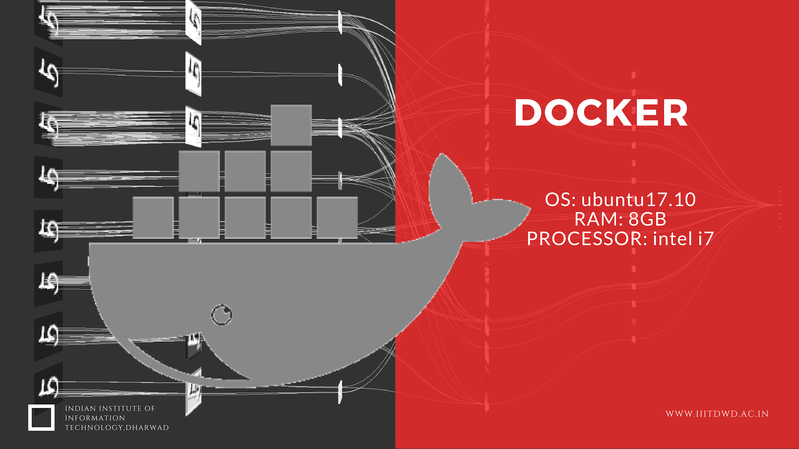

# Neural Storeyteller

Neural Storyteller is a recurrent neural network that generates little language description about images and their region. We first train a recurrent neural network (RNN) decoder on a source book which contains a lot of passages. Then we map each passage from the source to a skip-thought vector. The RNN then condition the skip-thought vector and aims to generate the passage that it has encoded. Along with this we will train a visual-semantic embedding COCO images and captions. The caption images are then map into a common vector space. After that we will embed new image and retrieve caption and generates a language description of that image.

